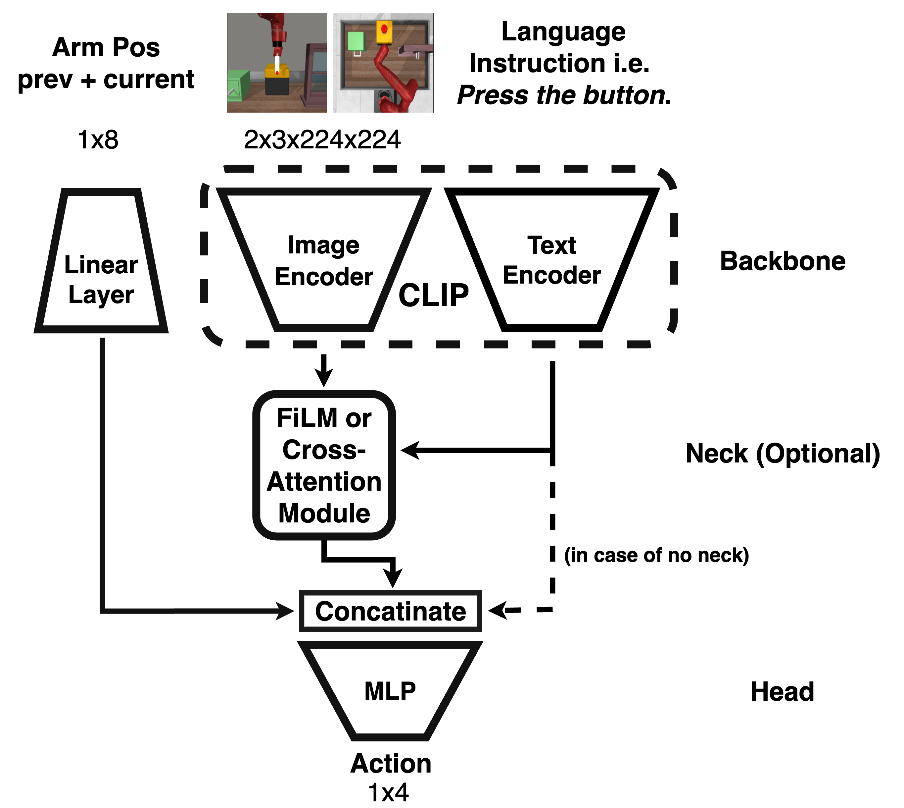
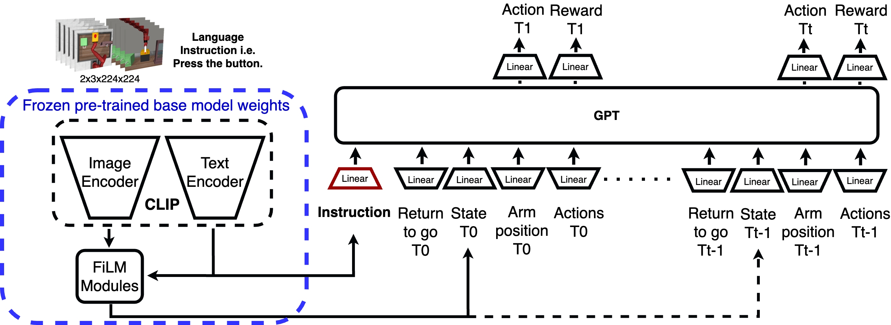

# Multitask Instruction Agent

## Introduction
Reinforcement learning techniques have improved robotic systems manipulation. 
Our research introduces a sophisticated agent that navigats a robotic manipulator through diverse tasks. 
Unlike traditional approaches, our method seamlessly transitions between activities using visual input and linguistic instructions. 

 

*Contact:* Ahmed Mansour - ahmed_salah1996@yahoo.com

## Components

### Meta-World Environment
- **Description:** An open-source benchmark for meta-reinforcement learning, consisting of 50 distinct robotic manipulation tasks.
- **Use case modification:** 10 tasks were selected, with the simulator modified to handle three tasks concurrently.
- **Data Generation:** Utilized SAC agents for generating datasets encompassing visual information, state observations, actions, rewards, and success flags.
- **Tasks:** button-press-topdown-v2, button-press-v2, door-lock-v2, door-open-v2, drawer-open-v2, window-open-v2, faucet-open-v2, faucet-close-v2, handle-press-v2, coffee-button-v2.

    

### Algorithms Overview
- **Soft Actor Critic (SAC):** more info can be found here (https://stable-baselines3.readthedocs.io/en/master/modules/sac.html)

- **CLIP:** CLIP model was used to encode the images using ViT as in the following figure and Language instructions using a transformer encoder.
 

- **FiLM:** for more info: (https://github.com/caffeinism/film-pytorch)

- **Base Model:** 

    

- **Decision Transformer model:** 
 

### What is provided in the repo:
- **Modified Metaworld environment:** the environment holds 3 tasks as a time, this applies only on the visual rendered env observation, which means the vector observation includes only one task.
for trying, run: python  test_single.py

- **training script of baseline3 SAC:**  
train_sac_on.py script is used to train a SAC agent on a single task, to use:

  'python train_sac_on.py <task_name> <task_pos>'

  * task_name i.e. button-press-v2 
  * task_pos i.e. 0
  * task poses are 0 1 2 3 which are equivalent to right middle left Mix, which means where the target task should be placed on the table.
  * the training configs can be found under the directory configs/sac_configs/<task-name>.json 
  note: if task-name doesn't exist in the directory then defauld.json will be used.

- **dataset generation:**
after training the SAC agents, you can use them for generating dataset, using generate_data.py script, the script gets:
arguments from train_utils/args.py
  1. configs/general_model_configs/agents_dict.json to configure the best agent for every task
  2. for data generation run:
sh experiments/generate_dataset.sh

- **general model training and RL fine-tuning:**
many examples for different models for training or evaluation in experiments directory, for example:
  * train_base.sh  for training base model (clip + linear head)
  * train_film.sh  for training base model (clip + film layers + linear head)
  * train_dt.sh    for training base model (clip + film layers + decision transformer)
  * finetune_dt.sh for training base model (clip + film layers + decision transformer + dt lora layers)
  * train_dt_obs.sh for training decision transformer only using the vector observation without images.
  * finetune_base_rl.sh for fine tuning a pretrained model with PPO using baseline3 framework (we did not get promising results with this yet) 
- **Installations**
  * for Metaworld installations, please follow the instrucions in Metaworld repo (https://github.com/Farama-Foundation/Metaworld) or in L2M repo (https://github.com/ml-jku/L2M)
  * Baseline3: (https://stable-baselines3.readthedocs.io/en/master/guide/install.html)
  * CLIP: (https://github.com/openai/CLIP)

- **references:**
  * Soft-Actor-Critic: (https://arxiv.org/pdf/1801.01290v2.pdf)
  * FiLM: (https://arxiv.org/pdf/1709.07871.pdf)
  * Metaworld: (https://github.com/Farama-Foundation/Metaworld)
  * CLIP: (https://github.com/openai/CLIP)
  * Decision Transformer: paper:(https://arxiv.org/pdf/2106.01345.pdf)   implementation from nanoGPT:(https://github.com/karpathy/nanoGPT) 
  * Learning to Modulate pre-trained Models in RL: (https://arxiv.org/pdf/2306.14884.pdf)

